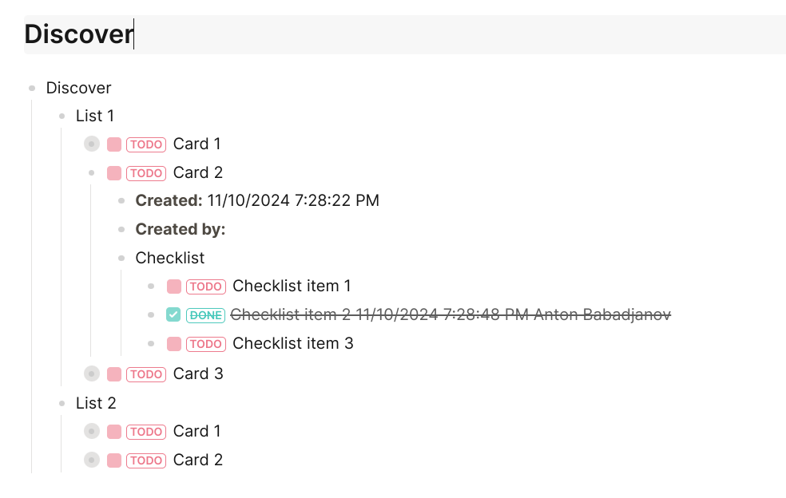

**TrelloExport to Logseq Processor** is a console application for Linux or Windows which takes Markdown files generated by [TrelloExport](https://github.com/trapias/TrelloExport/wiki) and reformats the data so that it is suitable for use in Logseq.

What this tool does:
* Recreate hierarchy of lists and cards as blocks and sub-blocks
* Ensure each card becomes a TODO
* Ensure each checklist item becomes a TODO (or DONE if checked)
* Properly indent all card descriptions in a description block
* Remove unnecessary white space created by TrelloExport that is not suitable for Logseq

|From||To|
|---|---|---|
||=>||

You can see that the hierarchy of pages has been transformed into a hierarchy of blocks in Logseq. This model is particularly useful for people who create a large number of small pages and use the hierarchy to organize their notes by fairly granular topics. Converting each one of these pages to a separate Markdown file will create potentially too many pages in Logseq.

# How to use

1. This script takes Markdown as an input, so you first have to export a board from Trello using TrelloExport:

https://github.com/trapias/TrelloExport/wiki

2. Run te2ls:

`python3 te2ls.py /path/to/input.md /path/to/output.md`

|Parameter|Description|
|---|---|
|Input file|The path or name of the file you got from TrelloExport. The parameter does not have a name, it's just the first parameter.|
|Output file|The path or name of the file you where results should be saved. The parameter does not have a name, it's just the first parameter.|

3. Copy the produced output files to your graph.

Copy the output file to your `pages` sub-folder in your Logseq graph folder (or wherever else in the hierarchy you like).

4. Handle attachments manually.

As TrelloExport does not export attachments, but rather links to them by URL, you will have references to them from within your pages. The problem is that the Logseq editor cannot be logged in to your Trello so these attachments will have no preview within Trello. You can still click the links to open them in a browser that is logged in to Trello, provided you also keep them in Trello.

# Limitations

| Limitation| Support |
| --- | --- |
| Download images locally | 🔴 |

# License

Released under the Apache 2.0 license.

This software carries no warranty of any kind. Some data can be lost during the conversion process. Always keep a backup of the source and double or triple verify the exported result before using it.

# Contribute

I am unlikely to be able to dedicate much or any time for supporting this.

Bugs and feature requests can be reported under [Issues](https://github.com/antonba/trelloexport2logseq/issues).
